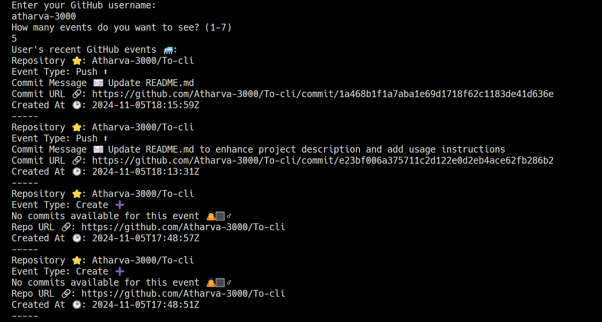

# GitHub CLI Tool ⭐

> **Put your Head Down and Work Hard**

A CLI to fetch your recent GitHub commits, **NO BS NO GUI**



## Features 😺

- View recent GitHub events (🚀)
- Fetch and display commit messages (📝)
- Lightweight and easy to use (🔥)
- **NO BS**

## Installation 🕹️

Clone the repository:

```bash
git clone https://github.com/atharva-3000/commit-cli.git
cd commit-cli
go run main.go
```

or **run the executable**

## Getting Started 🚀

Follow the prompts to enter your GitHub username and the number of events you want to see. The tool will fetch and display your recent GitHub events.

## Usage 👇🏼

Main Menu
Choose an option:

```
Enter your GitHub username:
How many events do you want to see? (1-7)
```

### Viewing Events

Enter your GitHub username and the number of events you want to see. The tool will fetch and display your recent GitHub events, including event type, repository name, and commit messages.

## Requirements 🖥️

- Go 1.23.2+
- Internet connection to fetch GitHub events

## Contributing 🫂

Contributions are welcome! If you have any ideas or improvements, feel free to open an issue or a pull request.

Here's how to contribute:

1. Fork the repository
2. Create a feature branch: `git checkout -b feature-name`
3. Commit your changes: `git commit -m 'Add feature'`
4. Push to your branch: `git push origin feature-name`
5. Open a pull request

## License 📃

This project is licensed under the MIT License.

Happy task tracking!
[Idea Here](https://roadmap.sh/projects/github-user-activity)
